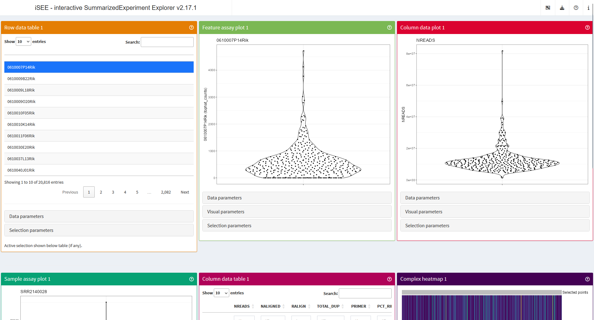
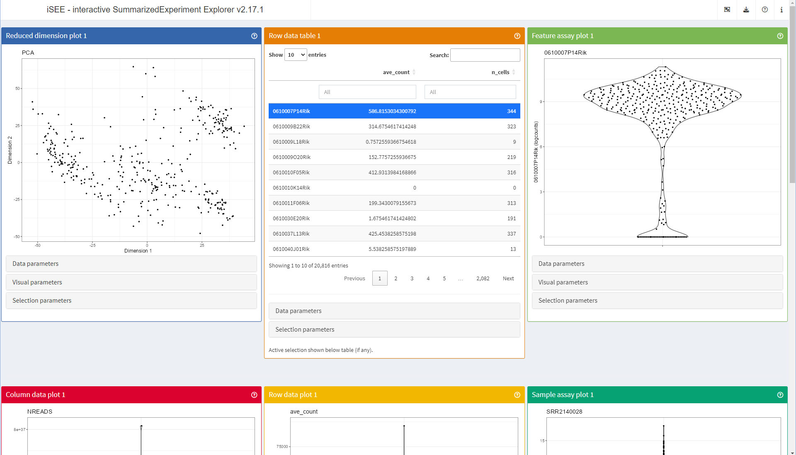
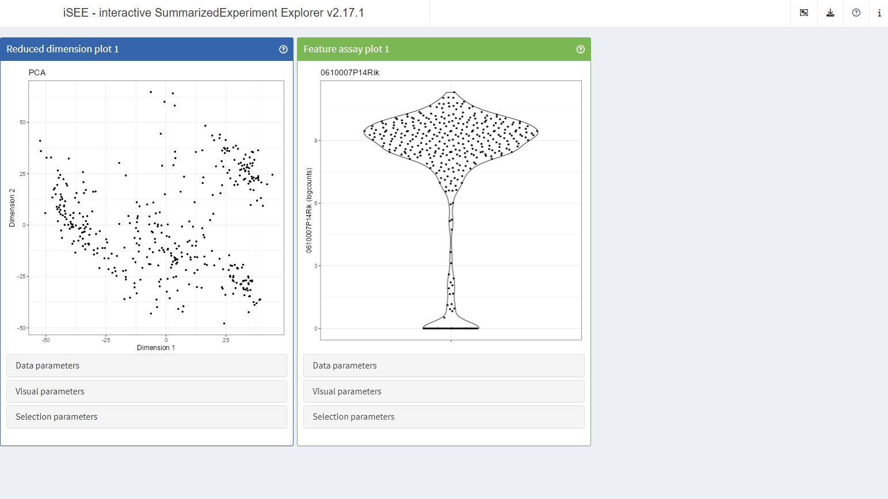

```{r, include = FALSE}
knitr::opts_chunk$set(
  collapse = TRUE,
  comment = "#>"
)
options(width)
library(iSEE)
```

Last modified: 09 July, 2024.

## Overview

### Description

This package demo will present a brief introduction to the functionality of the `r BiocStyle::Biocpkg("iSEE")` package and its existing extension packages, before demonstrating the writing of new functionality suitable for release in additional extension packages.

### Pre-requisites {#prerequisites}

Workshop prerequisites:

* Familiarity with the `r BiocStyle::Biocpkg("SummarizedExperiment")` class.
* Familiarity with the `r BiocStyle::CRANpkg("shiny")` package

Relevant background reading:

* EuroBioC2023 workshop:
  [materials](https://isee.github.io/iSEEDemoEuroBioC2023/articles/iSEEdemo.html)
* EuroBioC2020 workshop: 
  [materials](https://isee.github.io/iSEEWorkshopEuroBioc2020/),
  [slides](https://isee.github.io/iSEEWorkshopEuroBioc2020Slides/)
* BioC2020 workshop: 
  [materials](https://isee.github.io/iSEEWorkshop2020/),
  [slides](https://isee.github.io/iSEEWorkshop2020Slides/)
* BioC2019 workshop:
  [materials](https://isee.github.io/iSEEWorkshop2019/),
  [slides](https://isee.github.io/iSEEWorkshop2019Slides/)
* Rue-Albrecht K, Marini F, Soneson C and Lun ATL.
  iSEE: Interactive SummarizedExperiment Explorer
  [version 1; peer review: 3 approved]. F1000Research 2018, 7:741
  (https://doi.org/10.12688/f1000research.14966.1)
* Vignette: [SummarizedExperiment for Coordinating Experimental Assays, Samples, and Regions of Interest](https://bioconductor.org/packages/release/bioc/vignettes/SummarizedExperiment/inst/doc/SummarizedExperiment.html#anatomy-of-a-summarizedexperiment)

### Participation

Students are encouraged to ask questions throughout the package demo.

Where applicable, instructors will illustrate answers with live-coded examples.

Alternatively, students are also encouraged to write questions before, during, and after the workshop using the 'New issue' button on the GitHub repository for this workshop (https://github.com/iSEE/iSEEDemoEuroBioC2024/issues).

Instructors will respond to GitHub issues at the earliest opportunity, which may be after the end of the conference.

### _R_ / _Bioconductor_ packages used

* `r BiocStyle::Biocpkg("iSEE")`
* `r BiocStyle::Biocpkg("iSEEde")`
* `r BiocStyle::Biocpkg("iSEEhex")`
* `r BiocStyle::Biocpkg("iSEEhub")`
* `r BiocStyle::Biocpkg("iSEEindex")`
* `r BiocStyle::Biocpkg("iSEEpathways")`
* `r BiocStyle::Biocpkg("iSEEu")`

### Time outline

An example for a 40-minute workshop:

| Activity                     | Time |
|------------------------------|------|
| iSEE functionality           | 10m  |
| Existing iSEE extensions     | 10m  |
| Writing iSEE extensions      | 10m  |
| Questions                    | 10m  |

### Workshop goals and objectives

### Learning goals

* Describe how to interactively explore omics data using `r BiocStyle::Biocpkg("iSEE")`.
* Identify extension packages adding functionality to the `r BiocStyle::Biocpkg("iSEE")` interface.
* Understand what is needed to write `r BiocStyle::Biocpkg("iSEE")` extensions.

### Learning objectives

* Launch `r BiocStyle::Biocpkg("iSEE")` applications to visualise examples data sets.
* Configure `r BiocStyle::Biocpkg("iSEE")` applications to use functionality from extension packages.
* Create and include a new `r BiocStyle::Biocpkg("iSEE")` panel in a live application.

## iSEE functionality

### Overview

In the next 10 minutes, we will:

* Load a demonstration data set
* Launch an iSEE app in its default state
* Export an R script representing a modified app state
* Re-launch the same iSEE app preconfigured in that modified state

### Input data

`r BiocStyle::Biocpkg("iSEE")` was designed around the `r BiocStyle::Biocpkg("SummarizedExperiment")` class, a container widely used throughout the *Bioconductor* project.

Briefly, the `r BiocStyle::Biocpkg("SummarizedExperiment")` class provides a container keeping matrices of assay data, sample metadata, and feature metadata synchronised throughout analytical workflows (e.g., filtering, reordering).


<br/>

By extension, `r BiocStyle::Biocpkg("iSEE")` naturally supports classes derived from `r BiocStyle::Biocpkg("SummarizedExperiment")`.
For instance, the `r BiocStyle::Biocpkg("SingleCellExperiment")` class adds functionality for storing matrices of reduced dimensions, also keeping those synchronised with assay data and metadata during analyses.

In practice, you would generally create a `r BiocStyle::Biocpkg("SummarizedExperiment")` (or derived) object from raw data and metadata loaded from files (e.g., RNA-seq count matrix produce by a program like [featureCounts](https://doi.org/10.1093/bioinformatics/btt656) and sample metadata from your lab notebook).

`r fontawesome::fa("circle-info")` You can learn about the creation and handling of `SummarizedExperiment` objects in the [Relevant background reading](#prerequisites) resources above.

In this workshop, we will load a publicly available `r BiocStyle::Biocpkg("SingleCellExperiment ")` object to save some time.

```{r, message=FALSE, warning=FALSE}
library(scRNAseq)
sce <- ReprocessedAllenData(assays="tophat_counts")
sce
```

In the summary view of the object displayed above, we can tell that it contains:

* One assay called `tophat_counts`, a matrix measuring 20,816 genes in 379 cells.
* Twenty two columns of cell metadata.
* No gene metadata.

Also of note:

* Gene symbols are in use for the row names.
* Arbitrary cell names are in use for column names.
* Some object-level metadata is present.
* An alternative experiment called `ERCC` is present (we will not use it).

### Getting started with iSEE

One of the strengths of `r BiocStyle::Biocpkg("iSEE")` is that it can be used at any point in an analytical workflow.
From the moment raw data or metadata are encapsulated in a `r BiocStyle::Biocpkg("SummarizedExperiment")` object, they're good to go!

Let's demonstrate this by attaching the `r BiocStyle::Biocpkg("iSEE")` package to the R session and calling the `iSEE()` function to launch an app in the default settings.

```{r, message=FALSE, warning=FALSE, eval=interactive()}
library(iSEE)
iSEE(sce)
```



<br/>

In the screenshot above, you will notice that some of the panels seem to be truncated at the bottom.

`r BiocStyle::Biocpkg("iSEE")` applications organise panels along a single-page layout.
Following `r BiocStyle::CRANpkg("shiny")` rules, pages are divided into 12 units horizontally, allowing up to 12 panels on a row before new rows are added to accommodate more panels.
Depending on the size and set-up of your monitors, you may comfortably fit a considerable number of panels in your own screen estate.

By default, `r BiocStyle::Biocpkg("iSEE")` applications adopt a "showcase" mode that populates the application with one panel of each type compatible with the assay data and metadata detected in the input object.

As such, in the screenshot above, we see at least:

* A 'Row data table' panel, displaying gene metadata.
* A 'Feature assay plot' panel, displaying assayed data for a gene.
* A 'Column data plot' panel, displaying a column of cell metadata.
* A 'Sample assay plot' panel, displaying assayed data for a sample.
* A 'Column data table' panel, displaying cell metadata.
* A 'Complex heatmap' panel, displaying assayed data for a set of genes.

### Core iSEE functionality

Within `r BiocStyle::Biocpkg("iSEE")` applications, users can interactively:

* View tables of metadata, filtering rows, and selecting a single row that may be highlighted in other panels.
* View plots of assay data and metadata, controlling data displayed along each axis, as well as visual aspects such as colour, shape, size, and faceting, using any suitable data or metadata present in the input object.
* Draw selections in plots using the built-in rectangular `r BiocStyle::CRANpkg("shiny")` brush or the slower but more flexible lasso selection implemented in `r BiocStyle::Biocpkg("iSEE")`.
* Transmit selection between panels, dynamically controlling which panels receive information from which panels.
* Use transmitted selections to highlight or restrict the corresponding data points in the receiving panel(s).
* Rearrange the layout of panels, adding, removing, or reordering panels at will.
* Resize the panels, in width and height.

Furthermore, you will also find functionality for:

* Downloading the panel outputs: in PDF format for plots, and CSV format for tables.
* Exporting an R script that reproduces exactly each panel output, including brushes and downstream effects related to transmitted selections.
* Exporting an R script that reproduces exactly the current layout of the application.
* Launching custom interactive tours introducing new users to the various components of the application.
* Opening the vignette of the `r BiocStyle::Biocpkg("iSEE")` package without leaving the application.
* Inspecting the session information.
* Learning more about iSEE, including how to cite it.
* Inspecting the overall object metadata (converted to JSON format).

To simulate a short analytical workflow, let us run some more code from the `?iSEE` help page to:

* Compute a normalised count matrix.
* Compute a PCA.
* Compute a t-SNE.
* Compute some simple gene metadata.

```{r, message=FALSE, warning=FALSE}
library(scater)
sce <- logNormCounts(sce, exprs_values="tophat_counts")

sce <- runPCA(sce, ncomponents=4)
sce <- runTSNE(sce)
rowData(sce)$ave_count <- rowMeans(assay(sce, "tophat_counts"))
rowData(sce)$n_cells <- rowSums(assay(sce, "tophat_counts") > 0)
sce
```

Then, as pointed out earlier, you are free to launch another `r BiocStyle::Biocpkg("iSEE")` app again at any point in an analytical workflow.

The `iSEE()` function automatically detects new assay data and metadata in the updated object, populating the application components with all the available information, old and new.

```{r, message=FALSE, warning=FALSE, eval=interactive()}
iSEE(sce)
```



<br/>

Comparing the screenshot above with the earlier one, you will notice that the first panel is now a 'Reduced dimension plot' panel, and that all other panels have shifted position down in the order of the layout (top to bottom, left to right).

Indeed, the last time we launched the app, the object did not contain any dimensionality reduction result.
The `iSEE()` function automatically detected that, and dropped that type of panel from the application.

To demonstrate the next functionality, let us interactively (within the app launched above) remove all the panels except for 'Reduced dimension plot 1' and 'Feature assay plot 1'.
Then, use the download icon in the navigation bar at the top of the app to find and click the 'Display panel settings' button.
You will be presented with an R script that looks as follows:

```{r}
initial <- list()

################################################################################
# Settings for Reduced dimension plot 1
################################################################################

initial[["ReducedDimensionPlot1"]] <- new("ReducedDimensionPlot", Type = "PCA", XAxis = 1L, YAxis = 2L, 
    FacetRowByColData = "driver_1_s", FacetColumnByColData = "driver_1_s", 
    ColorByColumnData = "NREADS", ColorByFeatureNameAssay = "logcounts", 
    ColorBySampleNameColor = "#FF0000", ShapeByColumnData = "driver_1_s", 
    SizeByColumnData = "NREADS", TooltipColumnData = character(0), 
    FacetRowBy = "None", FacetColumnBy = "None", ColorBy = "None", 
    ColorByDefaultColor = "#000000", ColorByFeatureName = "0610007P14Rik", 
    ColorByFeatureSource = "---", ColorByFeatureDynamicSource = FALSE, 
    ColorBySampleName = "SRR2140028", ColorBySampleSource = "---", 
    ColorBySampleDynamicSource = FALSE, ShapeBy = "None", SizeBy = "None", 
    SelectionAlpha = 0.1, ZoomData = numeric(0), BrushData = list(), 
    VisualBoxOpen = FALSE, VisualChoices = "Color", ContourAdd = FALSE, 
    ContourColor = "#0000FF", PointSize = 1, PointAlpha = 1, 
    Downsample = FALSE, DownsampleResolution = 200, CustomLabels = FALSE, 
    CustomLabelsText = "SRR2140028", FontSize = 1, LegendPointSize = 1, 
    LegendPosition = "Bottom", HoverInfo = TRUE, LabelCenters = FALSE, 
    LabelCentersBy = "driver_1_s", LabelCentersColor = "#000000", 
    VersionInfo = list(iSEE = structure(list(c(2L, 17L, 1L)), class = c("package_version", 
    "numeric_version"))), PanelId = c(ReducedDimensionPlot = 1L), 
    PanelHeight = 500L, PanelWidth = 4L, SelectionBoxOpen = FALSE, 
    RowSelectionSource = "---", ColumnSelectionSource = "---", 
    DataBoxOpen = FALSE, RowSelectionDynamicSource = FALSE, ColumnSelectionDynamicSource = FALSE, 
    RowSelectionRestrict = FALSE, ColumnSelectionRestrict = FALSE, 
    SelectionHistory = list())

################################################################################
# Settings for Feature assay plot 1
################################################################################

initial[["FeatureAssayPlot1"]] <- new("FeatureAssayPlot", Assay = "logcounts", XAxis = "None", 
    XAxisColumnData = "NREADS", XAxisFeatureName = "0610007P14Rik", 
    XAxisFeatureSource = "---", XAxisFeatureDynamicSource = FALSE, 
    YAxisFeatureName = "0610007P14Rik", YAxisFeatureSource = "---", 
    YAxisFeatureDynamicSource = FALSE, FacetRowByColData = "driver_1_s", 
    FacetColumnByColData = "driver_1_s", ColorByColumnData = "NREADS", 
    ColorByFeatureNameAssay = "logcounts", ColorBySampleNameColor = "#FF0000", 
    ShapeByColumnData = "driver_1_s", SizeByColumnData = "NREADS", 
    TooltipColumnData = character(0), FacetRowBy = "None", FacetColumnBy = "None", 
    ColorBy = "None", ColorByDefaultColor = "#000000", ColorByFeatureName = "0610007P14Rik", 
    ColorByFeatureSource = "---", ColorByFeatureDynamicSource = FALSE, 
    ColorBySampleName = "SRR2140028", ColorBySampleSource = "---", 
    ColorBySampleDynamicSource = FALSE, ShapeBy = "None", SizeBy = "None", 
    SelectionAlpha = 0.1, ZoomData = numeric(0), BrushData = list(), 
    VisualBoxOpen = FALSE, VisualChoices = "Color", ContourAdd = FALSE, 
    ContourColor = "#0000FF", PointSize = 1, PointAlpha = 1, 
    Downsample = FALSE, DownsampleResolution = 200, CustomLabels = FALSE, 
    CustomLabelsText = "SRR2140028", FontSize = 1, LegendPointSize = 1, 
    LegendPosition = "Bottom", HoverInfo = TRUE, LabelCenters = FALSE, 
    LabelCentersBy = "driver_1_s", LabelCentersColor = "#000000", 
    VersionInfo = list(iSEE = structure(list(c(2L, 17L, 1L)), class = c("package_version", 
    "numeric_version"))), PanelId = c(FeatureAssayPlot = 1L), 
    PanelHeight = 500L, PanelWidth = 4L, SelectionBoxOpen = FALSE, 
    RowSelectionSource = "---", ColumnSelectionSource = "---", 
    DataBoxOpen = FALSE, RowSelectionDynamicSource = FALSE, ColumnSelectionDynamicSource = FALSE, 
    RowSelectionRestrict = FALSE, ColumnSelectionRestrict = FALSE, 
    SelectionHistory = list())
```

The above R script creates an object called `initial` that contains all the information necessary for the `iSEE()` function to launch an app in a specific initial state.

All we need to do is:

* Run that R script, to create the `initial` object that represents the initial state of the app
* Pass this `initial` object to the `initial=` argument of the `iSEE()` function, to launch a new app in the desired initial state

```{r, message=FALSE, warning=FALSE, eval=interactive()}
iSEE(sce, initial = initial)
```



## Existing iSEE extensions

## Overview

In the next 10 minutes, we will:

* Load and preprocess a new demonstration data set
* Launch an iSEE app that includes panels implemented in extension packages

### iSEE extension packages

| Package | Purpose                                          |
|:--------|:-------------------------------------------------|
| [iSEE](https://github.com/iSEE/iSEE) | Core functionality. |
| [iSEEde](https://github.com/iSEE/iSEEde) | Extension for differential expression analysis. |
| [iSEEhex](https://github.com/iSEE/iSEEhex) | Extension for summarisation into hexagonal bins. |
| [iSEEhub](https://github.com/iSEE/iSEEhub) | Extension for access to the Bioconductor `r BiocStyle::Biocpkg("ExperimentHub")`. |
| [iSEEindex](https://github.com/iSEE/iSEEindex) | Extension for access to custom collectins of local and remote data sets. |
| [iSEEpathways](https://github.com/iSEE/iSEEpathways) | Extension for pathway analysis. |
| [iSEEu](https://github.com/iSEE/iSEEu) | The 'iSEE universe': Extension for miscellaneous and experimental functionality. |

### Input data

#### Load data

The `r BiocStyle::Biocpkg("iSEEpathways")` vignette [Integration with other panels](https://isee.github.io/iSEEpathways/articles/integration.html) can also be accessed locally using the R code `vignette("integration", package = "iSEEpathways")`.

In this part, we load the `r BiocStyle::Biocexptpkg("airway")` package, providing a `RangedSummarizedExperiment` object for RNA-Seq in airway smooth muscle cells.

```{r}
library(airway)
data(airway)
airway
```

#### Clean up factor levels

We quickly reorder the levels of the dexamethasone treatment, ensuring that the untreated level is first, and used as reference level during the upcoming differential expression analysis.

```{r}
airway$dex <- relevel(airway$dex, "untrt")
```

#### Convert gene identifiers to gene symbols

We also take a minute to convert rownames to more recognisable gene symbols using the annotation package `r BiocStyle::Biocannopkg("org.Hs.eg.db")`.

To avoid losing any information, we store a copy of the original Ensembl gene identifiers and the corresponding gene symbols in the row metadata.

To make sure that rownames are unique, we use the `r BiocStyle::Biocpkg("scuttle")` function `uniquifyFeatureNames()`.
The function uses the gene symbol if unique; otherwise it combines it with the Ensembl gene identifier to make it unique.

```{r, message=FALSE, warning=FALSE}
library("org.Hs.eg.db")
library("scuttle")
rowData(airway)[["ENSEMBL"]] <- rownames(airway)
rowData(airway)[["SYMBOL"]] <- mapIds(org.Hs.eg.db, rownames(airway), "SYMBOL", "ENSEMBL")
rowData(airway)[["uniquifyFeatureNames"]] <- uniquifyFeatureNames(
  ID = rowData(airway)[["ENSEMBL"]],
  names = rowData(airway)[["SYMBOL"]]
)
rownames(airway) <- rowData(airway)[["uniquifyFeatureNames"]]
```

#### Differential gene expression analysis

We run a standard `r BiocStyle::Biocpkg("DESeq2")` analysis.

```{r, message=FALSE, warning=FALSE}
library(DESeq2)
dds <- DESeqDataSet(airway, ~ 0 + dex + cell)
dds <- DESeq(dds)
res_deseq2 <- results(dds, contrast = list("dextrt", "dexuntrt"))
head(res_deseq2)
```

We embed the results of the `r BiocStyle::Biocpkg("DESeq2")` analysis within the `airway` object using the `r BiocStyle::Biocpkg("iSEEde")` function `embedContrastResults()`.

The function embeds the results in a way makes them detectable by the `iSEE()` function, and gives the possibility to store multiple differential expression results -- possibly from multiple methods such as `r BiocStyle::Biocpkg("edgeR")` and `r BiocStyle::Biocpkg("limma")` -- under different names.

```{r, message=FALSE, warning=FALSE}
library(iSEEde)
airway <- embedContrastResults(res_deseq2, airway, name = "dex: trt vs untrt")
airway
```

#### Pathway analysis

We prepare Gene Ontology gene sets of biological pathways using `r BiocStyle::Biocannopkg("org.Hs.eg.db")`.

Due to the use of `uniquifyFeatureNames()` above, we must first map pathway identifiers to the unique Ensembl gene identifier, to accurately perform pathway analysis using the feature identifiers matching those of the embedded differential expression results.

```{r, message=FALSE, warning=FALSE}
library("org.Hs.eg.db")
pathways <- select(org.Hs.eg.db, keys(org.Hs.eg.db, "ENSEMBL"), c("GOALL"), keytype = "ENSEMBL")
pathways <- subset(pathways, ONTOLOGYALL == "BP")
pathways <- unique(pathways[, c("ENSEMBL", "GOALL")])
pathways <- merge(pathways, rowData(airway)[, c("ENSEMBL", "uniquifyFeatureNames")])
pathways <- split(pathways$uniquifyFeatureNames, pathways$GOALL)
```

We can then run a standard `r BiocStyle::Biocpkg("fgsea")` analysis.

In this case, we rank genes using the log2 fold-change computed during the differential expression analysis.
The `r BiocStyle::Biocpkg("iSEEde")` function `log2FoldChange()` is a convenient method to fetch this information as a named vector in a format immediately compatible with the `fgsea()` function.

```{r}
library("fgsea")
set.seed(42)
stats <- na.omit(log2FoldChange(contrastResults(airway, "dex: trt vs untrt")))
fgseaRes <- fgsea(pathways = pathways, 
                  stats    = stats,
                  minSize  = 15,
                  maxSize  = 500)
head(fgseaRes[order(pval), ])
```

Similarly to the differential expression analysis, we embed the results of the `r BiocStyle::Biocpkg("DESeq2")` analysis within the `airway` object, this time using the `r BiocStyle::Biocpkg("iSEEpathways")` function `embedPathwaysResults()`.

```{r}
library("iSEEpathways")
fgseaRes <- fgseaRes[order(pval), ]
airway <- embedPathwaysResults(
  fgseaRes, airway, name = "fgsea (p-value)", class = "fgsea",
  pathwayType = "GO", pathwaysList = pathways, featuresStats = stats)
airway
```

#### Add normalised gene expression

```{r}
library("scuttle")
airway <- logNormCounts(airway)
```


Plan:

* Run code from the iSEEpathways vignette https://isee.github.io/iSEEpathways/articles/integration.html
* Launch the app
* Showcase the integration of pathways, DE, and core panels
  (e.g., select a pathway in the results table, show those genes in the volcano plot and heat map)

(Remember: 10 min)

## Writing iSEE extensions

```{r}

```

